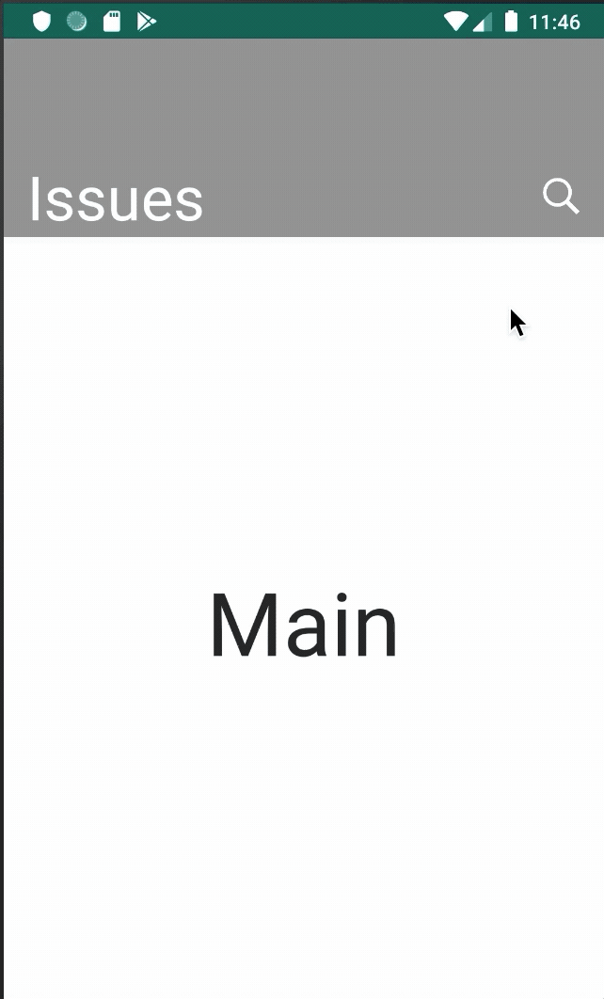

## Intro
This project is a custom implementation of MaterialSearchView.

The main reasons I had to create this project are:
* Show a search bar without action or toolbar.
* Show a prefix in search field, i.e.: "Issue# 'xx'" where 'xx' is the text you can enter to search and 'Issue#' is the prefix.
* Set a max length for the search field.

If you don't need any of these features, probably you are not in the right place. Please, take a look to the native one or other public repositories which I based my code: 
-  https://github.com/MiguelCatalan/MaterialSearchView
-  https://github.com/Mauker1/MaterialSearchView
- and some more...

# Sample GIF


## Attributes
        - searchBackground: background for the search view
        - searchVoiceIcon: voice icon
        - searchCloseIcon: close icon to clear the input text
        - searchBackIcon: back icon to close the search view
        - searchSuggestionIcon: icon for the suggested items
        - searchSuggestionBackground: background for the suggested items
        - android:hint: text where input text is empty
        - android:textColor: text color
        - android:textColorHint: text color for the hint text
        - android:inputType: android input type (num, phone, alphabetic...)
        - searchPrefix: prefix text
        - searchMaxLength: max input text length

## Usage
### XML
```xml
<com.sergibc.kmaterialsearchview.KMaterialSearchView
                android:id="@+id/search_view"
                android:layout_width="match_parent"
                android:layout_height="wrap_content"
                android:hint="@string/search_hint"
                android:inputType="text"
                android:textColor="#FFFFFF"
                android:textColorHint="#999999"
                app:searchBackIcon="@drawable/ic_arrow_back"
                app:searchBackground="@color/colorPrimaryDark"
                app:searchCloseIcon="@drawable/ic_close"
                app:searchMaxLength="5"
                app:searchPrefix="@string/prefix" />
```
### Code (Kotlin)
You can find or create the search view and call the public methods in `com.sergibc.kmaterialsearchview.KMaterialSearchView` class.

## TODOs
Publish aar to a public repository